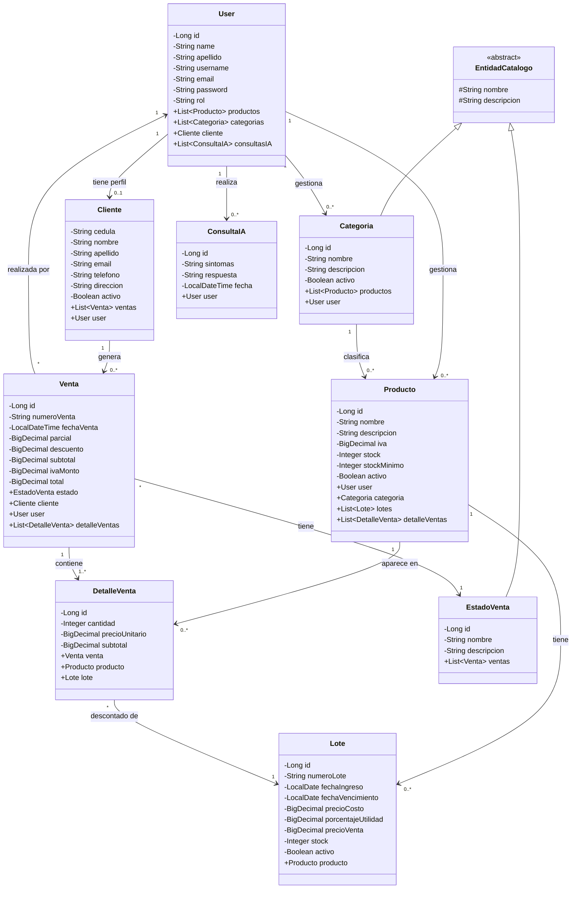

# Diagrama de Clases — Sistema de Farmacia

## Descripción de entidades

| Entidad | Tabla BD | Descripción |
|---|---|---|
| `User` | `USUARIOS` | Usuario del sistema. Rol `ADMIN` o `CLIENT`. |
| `Cliente` | `CLIENTES` | Perfil de cliente asociado 1:1 a un `User` con rol CLIENT. |
| `Categoria` | `CATEGORIAS` | Categoría de productos, creada por un admin. |
| `Producto` | `PRODUCTOS` | Medicamento o artículo del inventario. |
| `Lote` | `LOTES` | Lote de compra con costo, precio de venta y fecha de vencimiento. |
| `Venta` | `VENTAS` | Cabecera de una venta con totales calculados. |
| `DetalleVenta` | `DETALLE_VENTAS` | Línea de venta: producto, lote, cantidad y precio unitario. |
| `EstadoVenta` | `ESTADOS_VENTA` | Catálogo de estados (ej. COMPLETADA, ANULADA). |
| `ConsultaIA` | `CONSULTAS_IA` | Historial de consultas al asistente de IA (Gemini). |
| `EntidadCatalogo` | *(superclase)* | Clase base abstracta con `nombre` y `descripcion` para catálogos. |
